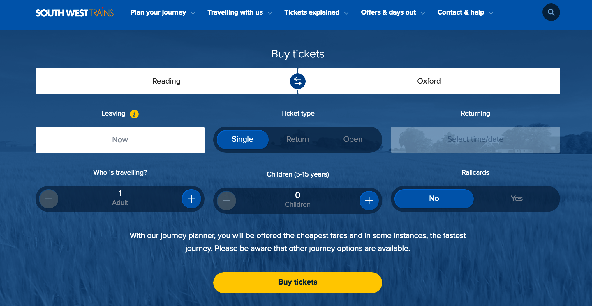
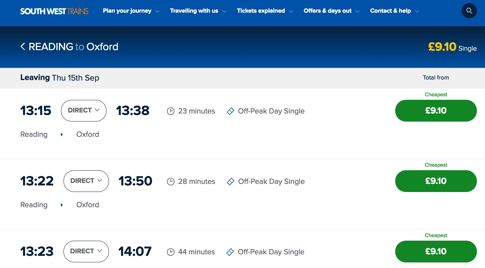
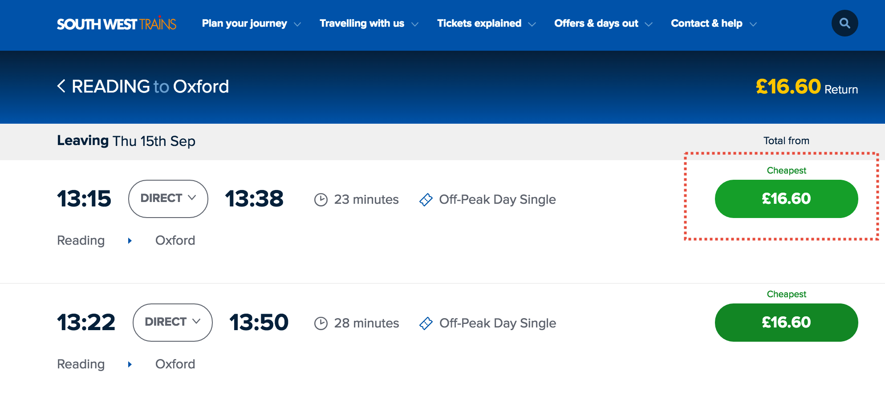
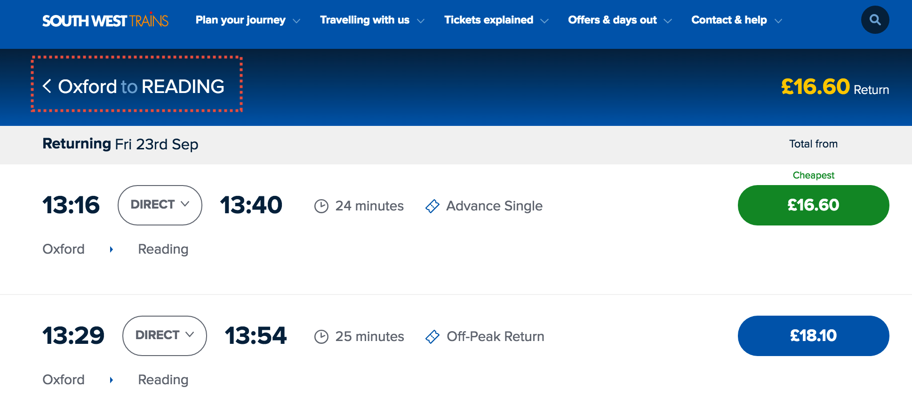
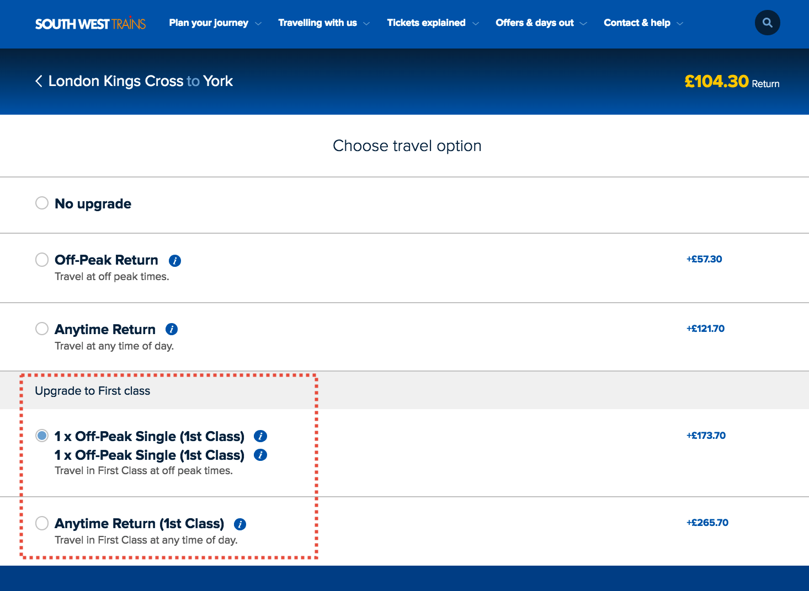
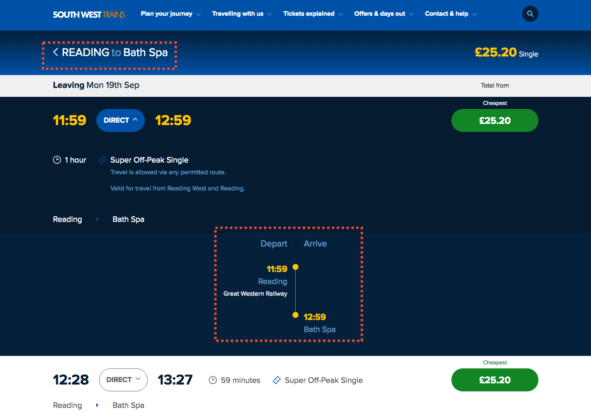
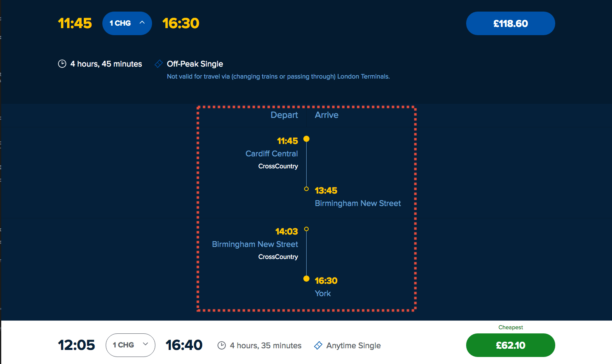

These exercises are part of the [Serenity Dojo](http://www.serenity-dojo.com/) training program, and are designed to help developers and testers learn how to work with Serenity Screenplay on real-world applications.

## The problem domain

This repository contains a number of real-world projects for Serenity Screenplay students to experiment with. Each mini-project will involve writing realistic tests for a real-world website. In this exercise, you will be testing the booking system of the [South West Rail Website](https://buytickets.southwesttrains.co.uk/)]. 

The example will use the following persona:
 - *Tracy*, a student who likes to book her tickets at the last minute, and
 - *Bill*, a businessman who plans trips in advance and likes to travel in First Class

### Scenario 1 - The one where Tracy books a one-way ticket from Reading to Oxford leaving now

Tracy buys a single ticket from Reading to Oxford.

#### Expected outcomes 
She should see "Reading to Oxford" on the result page heading, and at least one matching trip. Add displayed trips should show the duration and the ticket type (e.g. "Off-peak day single"), and specify that the trips start at Reading and go to Oxford ("Reading > Oxford").

### Scenario 2 - The one where Tracy books a return ticket from Reading to Oxford leaving now and returning tomorrow

Tracy books a return ticket from Reading to Oxford, returning sometime tomorrow. She selects the first available outbound trip:

#### Expected outcomes 
She should now see a list of return trips. The heading should be "Oxford to Reading", add displayed trips should show the duration and the ticket type (e.g. "Off-peak day single"), and specify that the trips start at Oxford and go to Reading ("Oxford > Reading").

### Scenario 3 - The one where Bill books a return ticket from Reading to Oxford leaving tomorrow

Bill books a return ticket from London Kings Cross to York, leaving tomorrow and returning in three days time. He selects the first available trains for the outgoing and return trip.
 
#### Expected outcomes 
 He should now have the option to upgrade to First Class:

### Scenario 4 - The one where Bill views the details of a trip for a direct trip

Bill books a single ticket from Reading to Bath Spa. He clicks on the "Direct" button for the first trip

#### Expected outcomes 
 He should now see the details of the trip, including the departure station and time, and the arrival station. The Departure and Arrival stations should match the requested route.  

### Scenario 5 - The one where Bill views the details of a trip for a trip with changes

Bill books a single ticket from Cardiff Central to York. He clicks on the "1 CHG" button for the first trip

#### Expected outcomes 
 He should now see the details of the trip, including the departure station and time, the arrival station and time, and the connecting station and connection time. The Departure and Arrival stations should match the requested route.  

